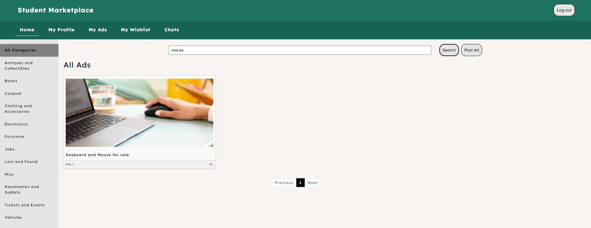
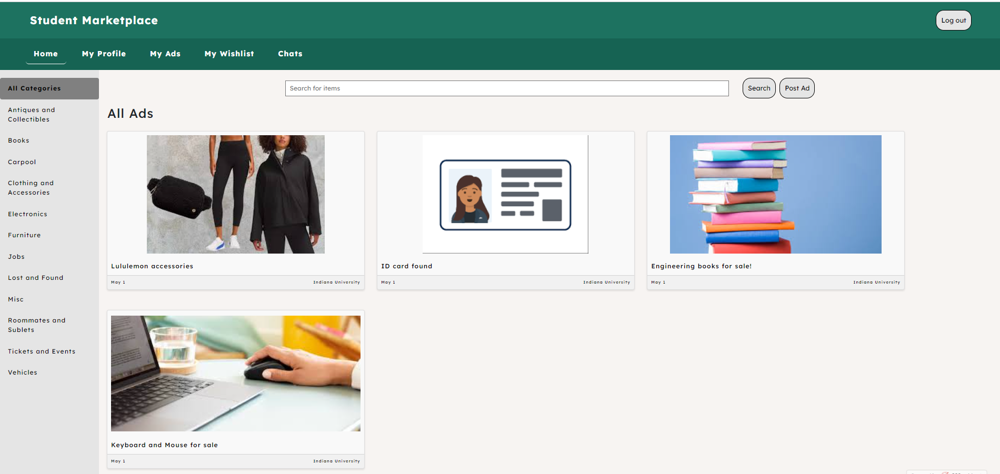
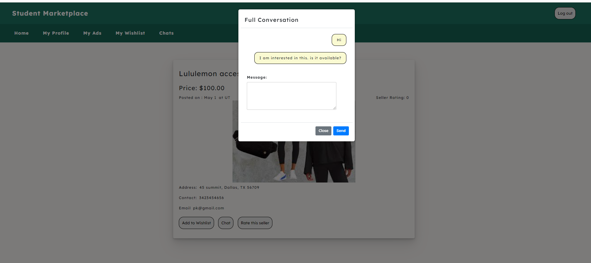
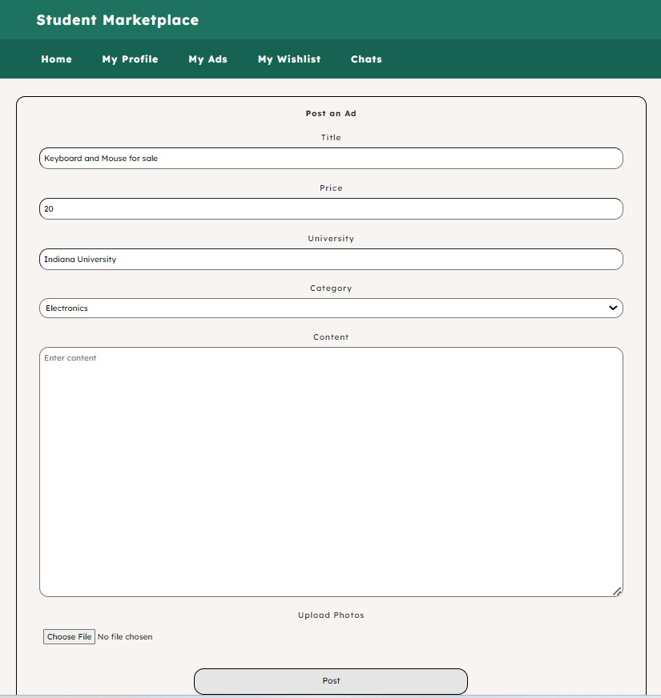
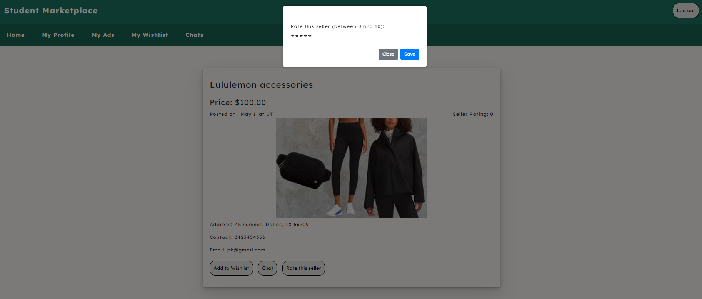
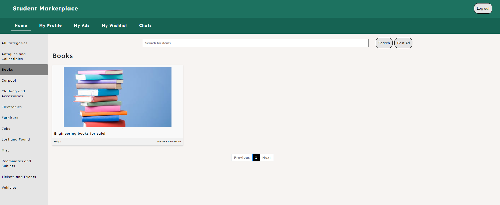
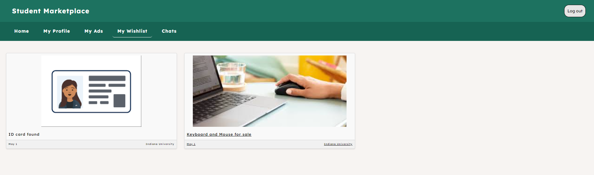

<!-- @format -->

# Student Marketplace

Student Marketplace is a dynamic online platform designed to connect students for buying and selling various products within their academic community. Built on Vite for efficient frontend development, React for interactive user interfaces, and PHP for a robust backend, this platform provides a seamless experience for students to trade goods and services.

## Features

1. **Product Search:** Users can easily search through a wide array of products available on the platform, making it effortless to find exactly what they need.
   

2. **Pagination:** With pagination, users can navigate through multiple pages of product listings efficiently, ensuring a smooth browsing experience.
   

3. **Robust Chat Feature:** Facilitating communication between sellers and buyers is crucial. Our platform offers a robust chat feature to enable direct interaction, negotiation, and clarification on product details.
   

4. **Profile Management:** Users can manage their profiles, update information, and track their activity on the platform, ensuring a personalized experience.
   

5. **Seller Ratings:** Trust is essential in any marketplace. Our platform incorporates a seller rating system, allowing buyers to rate sellers based on their experiences, fostering a reliable and transparent trading environment.
   

6. **Filtering:** Users can filter products based on categories, making it easier to narrow down their search to specific items of interest.
   

7. **Wishlist:** To keep track of desired items, users can add products to their wishlist, ensuring they don't miss out on any opportunities.
   

## Technologies Used

- **Frontend:** Vite, React
- **Backend:** PHP
- **Database Management:** PHPMyAdmin SQL

## Live Website

Check out the live website [here](https://student-marketplace1.000webhostapp.com/).
